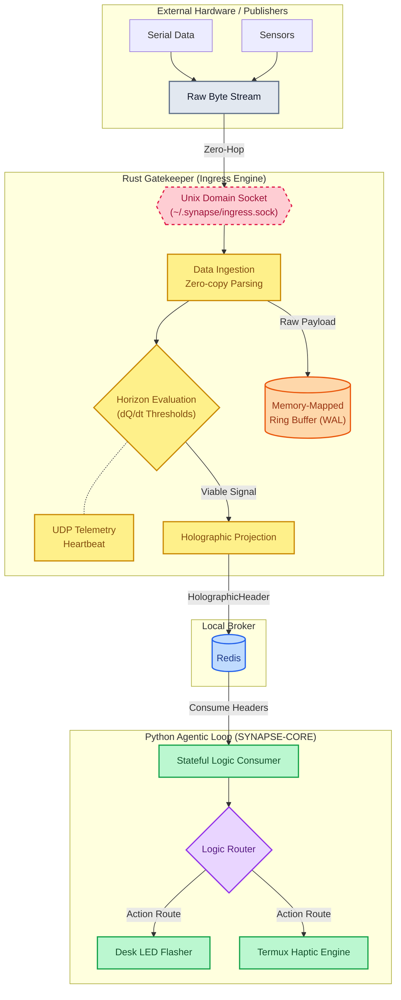

# Project SYNAPSE: True Membrane Architecture

## Abstract

Project SYNAPSE is a zero-latency, congestion-proof cybernetic message bus explicitly designed for mobile architectures within the Termux environment. It acts as the critical neurological link between raw hardware streams and high-level agentic logic, ensuring fault-tolerant routing on constrained Android devices.

## The Architecture (Ingress/Egress Split)

The architecture is built on a strict boundary between performance-critical ingestion and stateful logic:




1. **Rust Gatekeeper (Ingress):** Hardware streams feed directly into the Rust engine via Unix Domain Sockets (UDS), specifically located at `~/.synapse/ingress.sock`. The Rust layer performs critical $dQ/dt$ Schwarzschild threshold evaluation to determine signal viability without dropping frames.
2. **Holographic Projection:** Once evaluated, the Rust engine projects a lightweight `HolographicHeader` via a local Redis broker.
3. **Python Agent (Egress):** The `SYNAPSE-CORE` Python agentic loop consumes these HolographicHeaders to execute high-level orchestration, ensuring that heavy computational logic never blocks raw physical data ingestion.

## Deployment

To launch the system natively within an Android Termux environment, use the following explicit bootstrap sequence.

### 1. Compile and Start the Rust Engine

```bash
cd synapse
cargo build --release
./target/release/synapse
```

### 2. Initialize the Python Agentic Loop

Open a new Termux session or run alongside the backgrounded Rust engine:

```bash
cd SYNAPSE-CORE
python3 -m venv venv
source venv/bin/activate
pip install -r requirements.txt
python src/main.py
```
